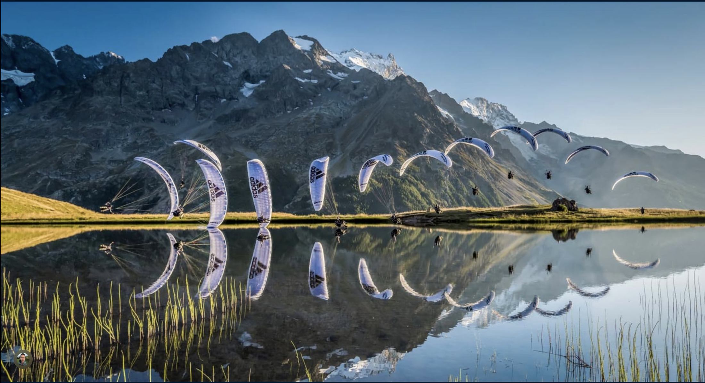
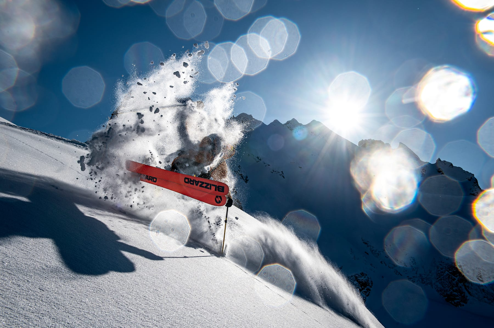

# oc25_maxime

## Site web

Pour réaliser ce travail, j'ai travailler avec html css et javascript, dans le but de proposer un site qui permet d'avoir accès à une liste de randonnée possible à faire. 


## page accueil
### HTML
```html
<!DOCTYPE html>

<html>
    <head>
        <title>
           Site Maxime Genoux
        </title>
        <meta charset="UTF-8">
         <link rel="stylesheet" href="css/style-accueil.css">
    </head>

    <body>
        <div id="navigation">
            <canvas id="image"></canvas>
            <script src="js/animation.js"></script>
            <ul>
                <li><a href="accueil.html">Accueil</a></li>
                <li><a href="été.html">Été</a></li>
                <li><a href="hiver.html">Hiver</a></li>

            </ul>
        </div>
        <h1> Site Maxime Genoux</h1>

        <br>
        <p id="texte">
            Bienvenu sur mon site web, ici vous pourrez trouver une liste de randonnées,
            que vous pourrez réaliser dans les alentours. Que ce soit sur le canton de Vaud, ou en Valais, 
            il y en a pour tous les goûts, et également pour tous les niveaux. 
            Ces randonnées couvrent aussi un programme annuel, que se soit en hiver,
            pour marcher sur la neige, faire de la raquette ou du ski de randonnée,
            Ansi qu'en été pour de la randonné pédestre.

        </p>

        <br>

        <p id="texte">
            Pour ceux qui cherche une escapade plutôt estivale
        </p>

        <br>

        <h2>  <a class="link_centre" href ="été.html">  
             </a> </h2>

        <br>

        <p id="texte">
            Et pour ceux qui souhaite s'évader dans les montagnes couvertes de neige
        </p>


        <h2>  <a class="link_centre" href ="hiver.html"> 
             </a> </h2>
        
        <br>

```
Cette page comporte une barre d'accueil qui est également sur toutes les autres page. 
```html
 <div id="navigation">
            <canvas id="image"></canvas>
            <script src="js/animation.js"></script>
            <ul>
                <li><a href="accueil.html">Accueil</a></li>
                <li><a href="été.html">Été</a></li>
                <li><a href="hiver.html">Hiver</a></li>

            </ul>
        </div>

```
Avec le style suivant pour permettre l'affichage en ligne.

### CSS

```css
#navigation {
    background-color:red ;
    padding-top: 1px;
    padding-bottom:1px;
    text-decoration: none;
    overflow: hidden;

}

#navigation canvas{
    position: absolute;
    top: 0;
    left: 0;
    width: 100%;
    height: 100%;
    pointer-events: none; 
    z-index: 0;    
}
 
#navigation ul{
    /* border:solid 1px blue; */
    position: relative;
    width: fit-content;
    padding-left: 0px;
    margin-left: auto;
    margin-right: auto;
}
#navigation li {
    display:inline;
    /* border:solid 1px red; */
    margin-left: 5px;
    margin-right: 5px;

}

```
Cela facilite ensuite, le fonctionnement du site, en reliant les unes aux autres, les pages principales. 

### Pages présentatives
Ensuite, nous avons deux pages qui permettent de faire le choix entre les randonnées, une par saison.
```html
<!DOCTYPE html>

<html>
    <head>
        <title>
           Site Maxime Genoux
        </title>
        <meta charset="UTF-8">
        <link rel="stylesheet" href="css/style-hiver.css">
    </head>

    <div id="navigation">
        <canvas id="image"></canvas>
        <script src="js/animation.js"></script>
        <ul>
            <li><a href="accueil.html">Accueil</a></li>
            <li><a href="été.html">Été</a></li>
            <li><a href="hiver.html">Hiver</a></li>

        </ul>
    </div>
        
    <h1> Randonnée d'hiver </h1>
    <br>

    <h2 id="valais"> Randonnée à pied ou en raquettes </h2>
    <ul>
        <li> <a href="Tour_go.html">Le Gô</a> </li>
        <li> <a href="Fouly.html">La Fouly - Prayon</a></li>
    
    </ul>

    <br>

    <h2 id="vaud"> Randonnée à ski </h2>
    <ul>
        <li> <a href="Arolla.html"> Montée à la cabane des Vignettes</a></li>
        
    </ul>

```

Les deux pages sont similaires et avec le style CSS suivant :
```css
body{ 
    font-family:Impact, Haettenschweiler, 'Arial Narrow Bold', sans-serif;
    color: red;
    background-color:  black;
    margin-left: auto;
    margin-right: auto;

}

h1{
    color: white;
    background-color: red;
    margin-left: auto;
    margin-right: auto;
}

#valais{

    color:white;
    background-color: red;
    border-radius: 18;
    padding-right: -3cm;
}

#vaud{

    color:white;
    background-color: red;
    border-radius: 18;

}

body{
    border: solid 1px rgb(144, 49,47); 
    max-width: 1000px;
    margin-left: auto;
    margin-right: auto;
    padding-left: 5px;
    padding-right: 5px;
}

#navigation {
    background-color:red ;
    padding-top: 1px;
    padding-bottom:1px;
    text-decoration: none;
    overflow: hidden;

}

#navigation canvas{
    position: absolute;
    top: 0;
    left: 0;
    width: 100%;
    height: 100%;
    pointer-events: none; 
    z-index: 0;    
}
 
#navigation ul{
    /* border:solid 1px blue; */
    position: relative;
    width: fit-content;
    padding-left: 0px;
    margin-left: auto;
    margin-right: auto;
}
#navigation li {
    display:inline;
    /* border:solid 1px red; */
    margin-left: 5px;
    margin-right: 5px;

}

a{
    color:white;
    margin-left: auto;
    margin-right: auto;
    text-decoration: none;
}

```

## Pages pour les tours 
##HTML
```html
<!DOCTYPE html>

<html>
    <head>
        <title>
           Site Maxime Genoux
        </title>
        <meta charset="UTF-8">
        <link rel="stylesheet" href="css/style-Tour.css">

    </head>

    <body>
        <div id="navigation">
             <canvas id="image"></canvas>
            <script src="js/animation.js"></script>
            <ul>
                <li><a href="accueil.html">Accueil</a></li>
                <li><a href="été.html">Été</a></li>
                <li><a href="hiver.html">Hiver</a></li>

            </ul>
        </div>

        
        <h1> Montée à la cabane des Vignettes</h1>

        
        <br>
        <a href = "https://schweizmobil.ch/fr/tour/1217069893?bgLayer=pk&resolution=5.05&photos=yes&detours=yes&season=summer&E=2602736&N=1094871&logos=yes" > Tracé de SuisseMobile </a>

        
        <h2> Informations :</h2>
        <ul>
            <li> Arolla </li>
            <li> distance: 4.9km</li>
            <li> 1'172 m dénivelé positif</li>
            <li> 6 m dénivelé négatif</li>
            <li> durée: - </li>
        </ul>

        <h2> Description :</h2>
        <p>
            Vous deverez commencer par vous rendre dans le village d'Arolla, en valais. Vous pourrez commencer votre randonnée à ski,
            en longeant les pistes, ensuite vous pourrez prendre sur la gauche et quitter le domaine skiable pour vous avanturez
            au delà des limites des pistes. Vous commencerez par vous éloignez, en empruntant un chemin relativement facile, puis une fois arrivé dans une petite cuvette,
            il vous faudra continuer à monté pour rejoindre une arrête que vous deverez ensuite longer. Vous arriverez ensuite sur un léger replat qui sera suivi d'un autre
            bout de montée qui vous permettra de rejoindre le glacier, qui lui est relativement plat avant d'arrivé à la monté finale, qui vous permettra
            d'atteindre la cabane des Vignettes.
        </p>

        
    </body>

```
Avec le style CSS suivant :

```css
body{ 
    font-family:Impact, Haettenschweiler, 'Arial Narrow Bold', sans-serif;
    color: white;
    background-color:  black;
    margin-left: auto;
    margin-right: auto;

}

h1{
    color: white;
    background-color: red;
    margin-left: auto;
    margin-right: auto;
}

h2{
    color:red;
}


body{
    border: solid 1px rgb(144, 49,47); 
    max-width: 1000px;
    margin-left: auto;
    margin-right: auto;
    padding-left: 5px;
    padding-right: 5px;
}

#navigation {
    background-color:red ;
    padding-top: 1px;
    padding-bottom:1px;
    text-decoration: none;
    overflow: hidden;

}

#navigation canvas{
    position: absolute;
    top: 0;
    left: 0;
    width: 100%;
    height: 100%;
    pointer-events: none; 
    z-index: 0;    
}
 
#navigation ul{
    /* border:solid 1px blue; */
    position: relative;
    width: fit-content;
    padding-left: 0px;
    margin-left: auto;
    margin-right: auto;
}
#navigation li {
    display:inline;
    /* border:solid 1px red; */
    margin-left: 5px;
    margin-right: 5px;

}

a{
    color:white;
    margin-left: auto;
    margin-right: auto;
    text-decoration: none;
}
```

### Animation

En ce qui concerne l'animation j'ai choisi de l'insérer diractement dans la barre d'accueil, pour qu'elle soit disctre et rentre en harmonie avec le reste du site.

##Javascript

```js
```

```


